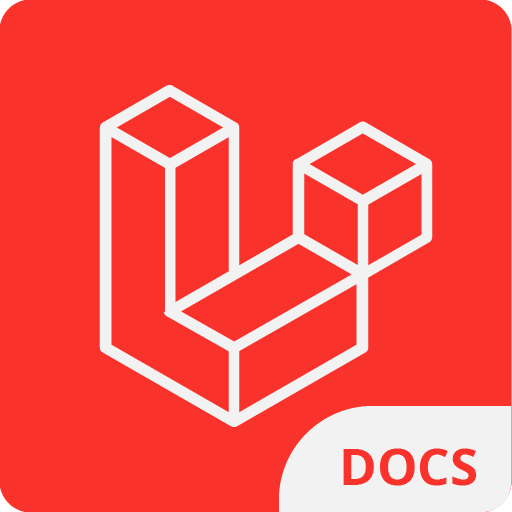

    

 

<h2 align="center"> Laravel Documentation VSCode Extension </h2>

Get Docs right in your vscode

---

## Features

- [x] Support for Laravel [9.x](/assets/docs/9.x) and [8.x](/assets/docs/8.x) Docs
- [x] Highlighted Codeblocks
- [ ] More soon...

---

#### Tools

- Svelte Webviews
- [Markedjs](https://github.com/markedjs/marked)
- [Highlightjs](https://github.com/highlightjs/highlight.js/) with GitHub Dark Theme and [Blade Language](https://github.com/miken32/highlightjs-blade)
- [DOMPurify](https://github.com/cure53/DOMPurify) to sanitize html ofcos

#### Theme

- [x] Works well with Dark Themes
- [ ] Light Themes to be supported soon

Check [Themes Demo](THEMES.md)

#### Author

[Franklin Shera](https://twitter.com/FranklinShera)
